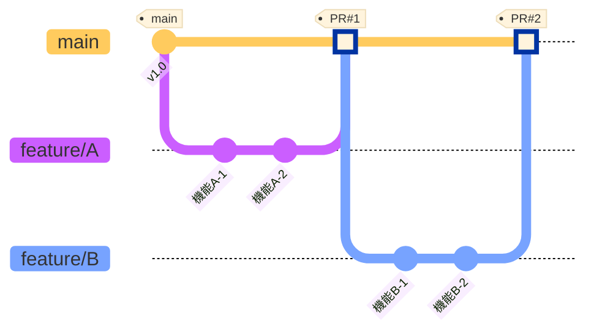
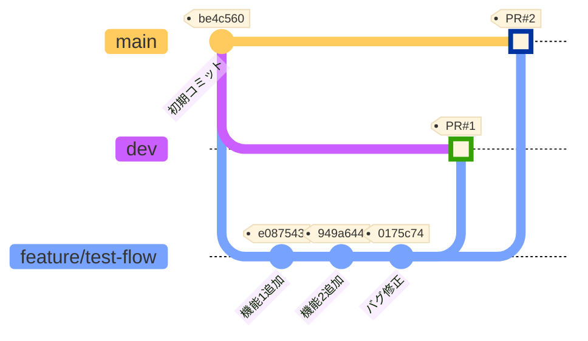
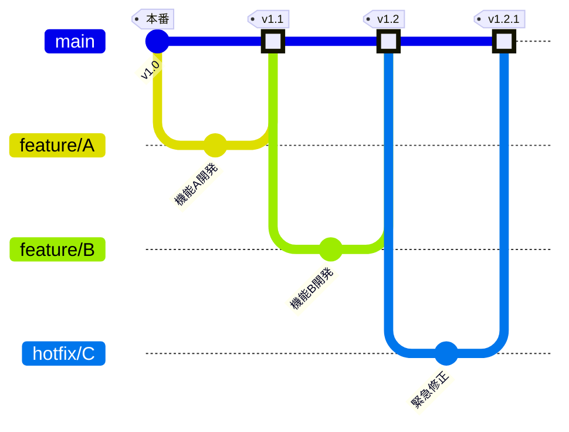
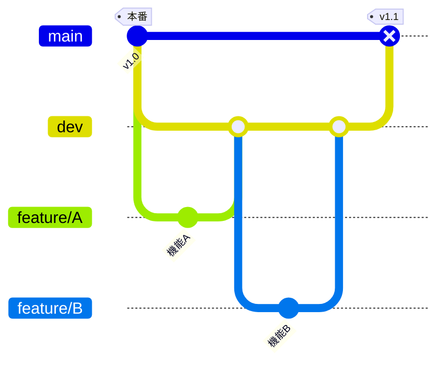

# Git Feature Flow 検証リポジトリ

このリポジトリは、Git Feature Flowの動作を検証するために作成されました。

## Git Feature Flowとは

**Git Feature Flow**は、各機能開発を独立させる開発フローです。

### 重要な原則

✅ **各featureは独立している** - これが最も重要
- featureは必ず**mainから分岐**する
- 他のfeatureの影響を受けない
- 単独でテスト・リリース可能

## Git Feature Flow 図（正しいパターン）



### フローの説明

1. **feature/A**: mainから分岐 → 開発 → mainにSquash merge
2. **feature/B**: mainから分岐 → 開発 → mainにSquash merge
3. 各featureは完全に独立し、並行開発可能

### このフローのメリット

- ✅ **完全な独立性**: 他のfeatureの影響を受けない
- ✅ **安定した基盤**: 本番コードをベースに開発
- ✅ **柔軟なリリース**: 任意のタイミングでリリース可能
- ✅ **シンプルな履歴**: mainの履歴が一直線で分かりやすい
- ✅ **rollbackが容易**: 問題があるfeatureだけ切り離せる

## ⚠️ 注意: devから分岐すると依存が発生する

このリポジトリでは、比較検証のため**誤ったパターン（devから分岐）**も実装しています。

### 実際に検証した内容（アンチパターン）



### 検証内容

- ❌ featureブランチを**devから分岐**（Git Feature Flowとしては誤り）
- ✅ Squash mergeの動作確認
- ✅ devとmain両方へのマージ検証

### このパターンの問題点

1. **依存関係が発生**: dev上の他の未完成機能に影響される
2. **独立性の喪失**: featureが完全に独立していない
3. **テストの複雑化**: dev上の他の変更も含めてテストが必要
4. **リリースの制約**: devの状態に依存してリリースタイミングが制約される
5. **Git Feature Flowの原則に反する**: 各featureの独立性が失われる

### Squash Merge の効果（参考）

- ✅ **履歴が整理される**: 3つのコミット → 1つのコミット
- ✅ **PR番号が自動付与**: `(#1)`, `(#2)` が追加される
- ✅ **トレーサビリティ**: GitHubでPRから元のコミット履歴を確認可能
- ⚠️ **異なるコミットハッシュ**: dev (97cae5b) と main (a7e1e87) で別のコミットが生成される

## Git Feature Flow vs Git Flow（比較）

### 手法の違い

| 観点 | **Git Feature Flow**<br>（推奨） | **Git Flow**<br>（別手法） |
|------|------------|-------------|
| **分岐元** | ✅ **mainから分岐** | devから分岐 |
| **独立性** | ✅ **完全に独立** | ❌ 依存関係が発生 |
| **基準コード** | ✅ 本番環境の安定コード | 開発中の最新コード |
| **安定性** | ✅ 安定したベース | ⚠️ 他の開発の影響を受ける |
| **リリース** | ✅ いつでもリリース可能 | devの状態に依存 |
| **テスト** | ✅ featureのみテスト | dev全体をテストが必要 |
| **コンフリクト** | ✅ mainとの差分が明確 | ⚠️ dev上の変更と競合 |
| **rollback** | ✅ feature単位で可能 | ⚠️ dev全体に影響 |

### Git Feature Flowの使い方（推奨）

```bash
# mainから分岐
git checkout main
git pull origin main
git checkout -b feature/new-feature

# 開発...
git add .
git commit -m "feat: 新機能を追加"

# mainにPR作成してSquash merge
# → PR #1でmainにマージ
```

**このフローが適しているケース:**
- ✅ **すべての機能開発** - 独立した機能追加
- ✅ **継続的デリバリー** - いつでもリリース可能
- ✅ **並行開発** - 複数チームでの開発
- ✅ **Hotfix** - 本番バグの緊急修正
- ✅ **A/Bテスト** - 機能のON/OFF切り替え

**メリット:**
- 🎯 **完全な独立性**: 他のfeatureの影響を一切受けない
- 🎯 **安定性**: 本番と同じコードベースで開発
- 🎯 **柔軟性**: いつでもリリース判断が可能
- 🎯 **シンプル**: ブランチ戦略が分かりやすい
- 🎯 **安全性**: 問題があっても該当featureのみrollback

### Git Flow（devから分岐）

```bash
# devから分岐（参考: このリポジトリの検証パターン）
git checkout dev
git pull origin dev
git checkout -b feature/new-feature

# 開発...
# devにマージ → まとめてmainへリリース
```

**この手法が適している場合:**
- ⚠️ **計画的なリリース** - 決まったタイミングで一括リリース
- ⚠️ **機能の相互依存** - 複数機能が密接に関連
- ⚠️ **統合テスト重視** - devで全体をテストしたい

**問題点（依存が発生）:**
- ❌ **独立性の喪失**: 他のfeatureに依存する
- ❌ **不安定な基盤**: dev上の未完成機能の影響
- ❌ **リリースの制約**: devの状態次第
- ❌ **テストの複雑化**: 他の変更も含めてテスト
- ❌ **Git Feature Flowではない**: 別の開発フロー

### 実際の開発フロー図

#### ✅ 推奨: Git Feature Flow（mainから分岐）



**特徴:**
- 各featureが完全に独立
- mainは常にリリース可能
- feature単位でリリース判断

#### ⚠️ 参考: Git Flow（devから分岐）



**特徴:**
- devで統合してからリリース
- featureが相互に依存
- 一括リリース

## まとめ

### Git Feature Flowの原則

1. ✅ **featureは必ずmainから分岐する**
2. ✅ **各featureは完全に独立させる**
3. ✅ **Squash mergeで履歴を整理する**
4. ✅ **いつでもリリース可能な状態を保つ**

### devブランチの扱い

- **Git Feature Flow**: devブランチは不要（mainのみ）
- **Git Flow**: devブランチで統合（別の手法）

### このリポジトリについて

このリポジトリでは、比較のために**両方のパターン**を検証しています：
- ✅ **正しいパターン**: mainから分岐（Git Feature Flow）
- ⚠️ **検証したパターン**: devから分岐（Git Flow、依存が発生）

**推奨**: **Git Feature Flow（mainから分岐）** を採用し、各featureの独立性を保ちましょう。
