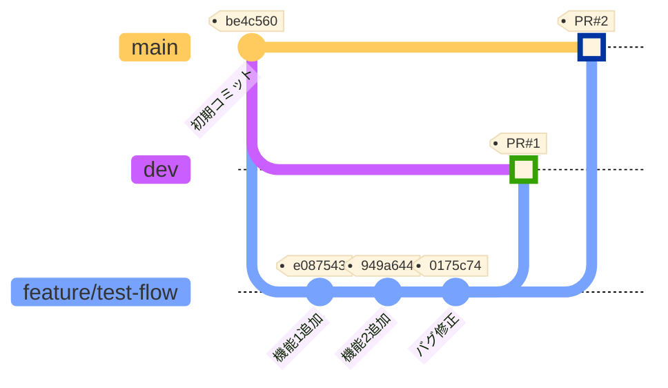

# Git Feature Flow 検証リポジトリ

このリポジトリは、Git feature flowの動作を検証するために作成されました。

## 検証内容

- featureブランチからdevブランチへのSquash merge
- featureブランチからmainブランチへのSquash merge
- マージ後の履歴の見え方の確認

## ブランチ構成

- `main`: 本番環境用のメインブランチ
- `dev`: 開発環境用のブランチ
- `feature/*`: 機能開発用のブランチ

## Git Feature Flow 図

このリポジトリで検証したGit feature flowを図示します。

### フローの説明

1. **初期状態**: `main`ブランチに初期コミット (be4c560)
2. **dev ブランチ作成**: mainから開発用のdevブランチを分岐
3. **feature ブランチ作成**: devからfeature/test-flowブランチを分岐
4. **機能開発**: featureブランチで3つのコミットを作成
   - 機能1追加 (e087543): `feat: 機能1のファイルを追加`
   - 機能2追加 (949a644): `feat: 機能2のファイルを追加`
   - バグ修正 (0175c74): `fix: 機能3のバグ修正とパフォーマンス改善`
5. **devへマージ**: PR #1でSquash mergeし、3つのコミットを1つにまとめる (97cae5b)
6. **mainへマージ**: PR #2でSquash mergeし、3つのコミットを1つにまとめる (a7e1e87)

### Squash Merge の効果

- ✅ **履歴が整理される**: 3つのコミット → 1つのコミット
- ✅ **PR番号が自動付与**: `(#1)`, `(#2)` が追加される
- ✅ **トレーサビリティ**: GitHubでPRから元のコミット履歴を確認可能
- ⚠️ **異なるコミットハッシュ**: dev (97cae5b) と main (a7e1e87) で別のコミットが生成される
