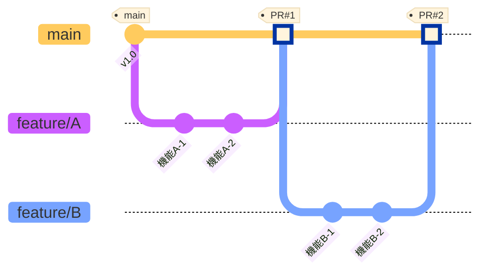
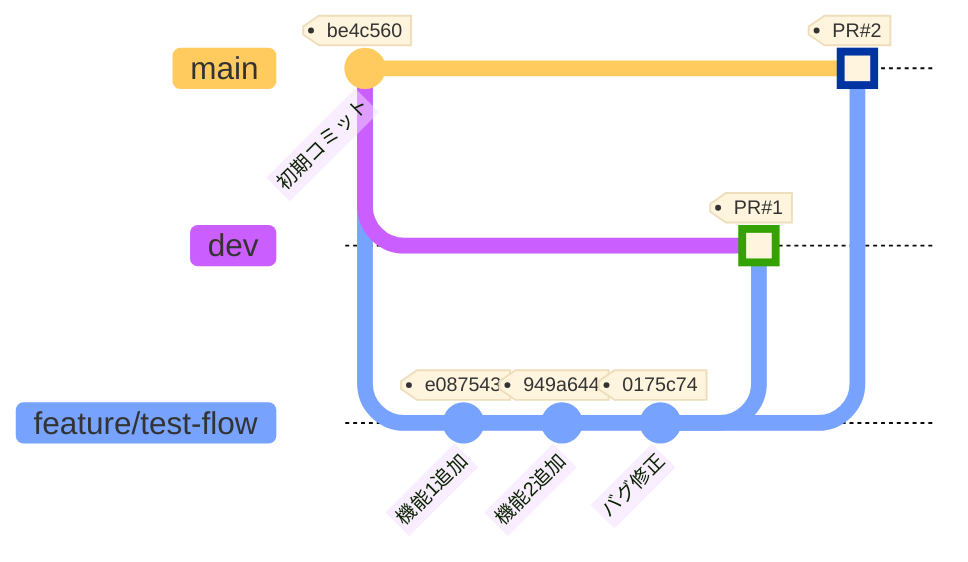
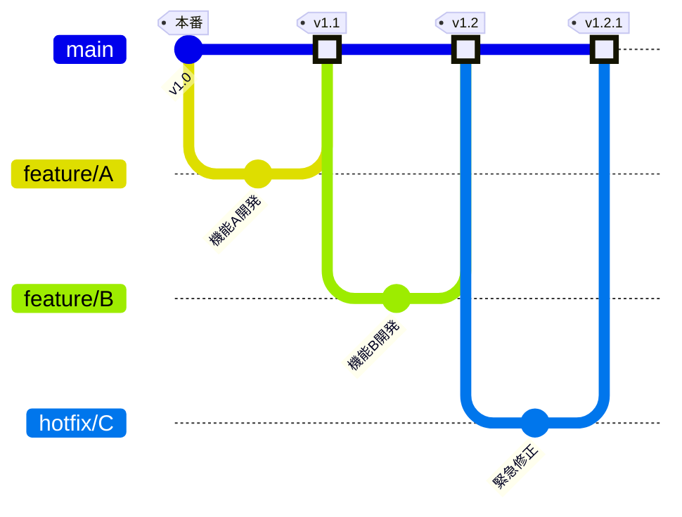
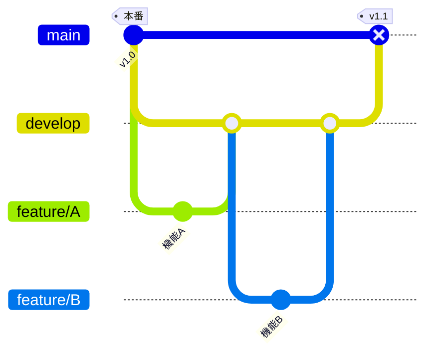

# Git Feature Flow 検証リポジトリ

このリポジトリは、Git Feature Flowの動作を検証するために作成されました。

## 参考文献

このリポジトリは、以下の記事を参考にしています：

📚 **[GitFlowは使わない！シンプルな「GitFeatureFlow」を紹介します](https://developers.gnavi.co.jp/entry/GitFeatureFlow/koyama)**
著者: 小山氏（ぐるなびエンジニア）

> ぐるなびで**2500回以上のリリース実績**があり、**フロー起因のバグは0件**という優れた実績を持つ開発フローです。

## Git Feature Flowとは

**Git Feature Flow**は、ぐるなびの小山氏が考案した、各機能開発を独立させる開発フローです。
Git FlowとGitHub Flowの中間的な位置づけで、**柔軟なリリーススケジュール**と**シンプルな運用**を両立します。

### 元記事で使用されているブランチ構成

```
master        # 本番リリース用
feature/*     # 各プロジェクトごとに master から切る
test-env      # テスト環境と同期
stg-env       # ステージング環境と同期
```

⚠️ **注意**: このリポジトリでは検証目的のため、`main`, `dev`, `feature/*`の簡略化した構成を使用しています。

### 環境ブランチによる安全な統合テスト

元記事のフル構成では、`test-env`と`stg-env`（ステージング環境）ブランチを使って段階的な検証を行います：

**test-env（テスト環境）**:
- 開発中の機能を早期にテスト環境で動作確認
- 個別featureまたは複数featureの組み合わせを柔軟にテスト

**stg-env（ステージング環境）**:
- 本番リリース前の最終統合テスト
- 複数のfeatureを組み合わせて動作確認
- 本番環境に近い条件でのテスト実施

✅ **統合テストの安全性**:
- mainマージ前にstg-envで複数featureの統合テストを実施できる
- feature間の相互作用の問題を早期発見
- 本番リリースのリスクを最小化

このアプローチにより、「各featureの独立性」を保ちながら、「統合テストの安全性」も確保できます。

## 重要な原則

✅ **各featureは独立している** - これがGit Feature Flowの核心
- featureは必ず**main（master）から分岐**する
- 他のfeatureの影響を受けない
- 単独でテスト・リリース可能

## Git Feature Flow 図（正しいパターン）



### フローの説明

1. **feature/A**: mainから分岐 → 開発 → mainにSquash merge
2. **feature/B**: mainから分岐 → 開発 → mainにSquash merge
3. 各featureは完全に独立し、並行開発可能

## Git Feature Flowのメリット

元記事および実践から分かっているメリット：

### ✅ リリース管理の柔軟性
- **同時進行する複数プロジェクトの規模差に対応**: 大小様々な機能を並行開発できる
- **緊急リリースと通常開発の両立**: Hotfixも同じフローで対応
- **リリース日の変更が容易**: 他のfeatureに影響しない
- **優先度によるリリース順序調整**: feature単位でリリース判断

### ✅ 開発プロセスの改善
- **完全な独立性**: 他のfeatureの影響を一切受けない
- **安定した基盤**: 本番と同じコードベースで開発
- **シンプルな履歴**: mainの履歴が分かりやすい
- **rollbackが容易**: 問題があるfeatureだけ切り離せる

### ✅ 実績
- ぐるなびで**2500回以上のリリース**
- **フロー起因のバグは0件**
- 開発者とディレクター間のコミュニケーション改善

## Git Feature Flowのデメリット・注意点

元記事では明示されていませんが、一般的に考えられる課題：

### ⚠️ マージコンフリクトの可能性
- **複数featureが同じファイルを変更**: mainへのマージ時にコンフリクトが発生しやすい
- **解決コスト**: 各feature担当者が個別にコンフリクト解決が必要

### ⚠️ 統合テストのタイミング
- **feature単位のテスト**: 複数featureの組み合わせテストはmainマージ後
- **統合問題の発見が遅れる可能性**: feature間の相互作用の問題が後から発覚
- ✅ **緩和策**: stg-env（ステージング環境）を使うことで、mainマージ前に複数featureの統合テストを安全に実施できる

### ⚠️ feature間の依存関係
- **依存がある場合は工夫が必要**: featureAに依存するfeatureBの開発タイミング調整
- **リリース順序の制約**: 依存関係があるfeatureは順番にリリース

### ⚠️ 環境ブランチの管理
- **test-env/stg-envの運用**: 環境ごとのブランチ管理が必要（元記事のフル構成の場合）
- **CI/CDの設定**: 各環境への自動デプロイ設定が必要

### ⚠️ チーム規模による向き不向き
- **小規模プロジェクト**: オーバーヘッドの可能性
- **大規模チーム**: コンフリクト解決の調整コスト

## Git Feature Flow vs Git Flow（公平な比較）

### 手法の違い

| 観点 | Git Feature Flow | Git Flow |
|------|-----------------|----------|
| **分岐元** | mainから分岐 | developから分岐 |
| **独立性** | ✅ 完全に独立 | ⚠️ develop上で依存 |
| **リリース** | ✅ feature単位で柔軟 | ⚠️ release単位で一括 |
| **統合テスト** | ⚠️ main上で実施 | ✅ develop上で事前実施 |
| **コンフリクト** | ⚠️ main マージ時 | ⚠️ develop マージ時 |
| **複雑さ** | ✅ シンプル | ⚠️ やや複雑（release, hotfix等） |
| **向いているケース** | 柔軟なリリース、継続的デリバリー | 計画的リリース、厳格な品質管理 |
| **実績** | ぐるなび: 2500回/バグ0件 | 多数の企業で採用実績 |

### それぞれが適しているケース

#### Git Feature Flowが適している
- ✅ **柔軟なリリーススケジュール**: 機能ごとに異なるリリース日
- ✅ **継続的デリバリー**: いつでもリリース可能な状態を保ちたい
- ✅ **並行開発**: 複数チームが独立して開発
- ✅ **Hotfix対応**: 緊急修正を通常フローで扱いたい

#### Git Flowが適している
- ✅ **計画的なリリース**: 決まったサイクルで一括リリース
- ✅ **厳格な品質管理**: develop上で十分な統合テストを実施
- ✅ **複数バージョン管理**: release, hotfixブランチで複数バージョンを並行保守
- ✅ **feature間の依存が多い**: 複数機能が密接に関連

## ⚠️ 注意: このリポジトリの検証内容

このリポジトリでは、**Git Feature Flowとしては誤ったパターン**も検証しています。

### 実際に検証した内容（devから分岐）



### 検証内容

- ❌ featureブランチを**devから分岐**（Git Feature Flowの原則に反する）
- ✅ Squash mergeの動作確認
- ✅ devとmain両方へのマージ検証

### このパターンの問題点

1. **依存関係が発生**: dev上の他の未完成機能に影響される
2. **独立性の喪失**: featureが完全に独立していない
3. **リリースの制約**: devの状態に依存してリリースタイミングが制約される
4. **Git Feature Flowではない**: これはGit Flowに近いパターン

### Squash Merge の効果（参考）

- ✅ **履歴が整理される**: 3つのコミット → 1つのコミット
- ✅ **PR番号が自動付与**: `(#1)`, `(#2)` が追加される
- ✅ **トレーサビリティ**: GitHubでPRから元のコミット履歴を確認可能
- ⚠️ **異なるコミットハッシュ**: dev (97cae5b) と main (a7e1e87) で別のコミットが生成される

## 実際の運用例

### ✅ Git Feature Flow（mainから分岐）

```bash
# mainから分岐
git checkout main
git pull origin main
git checkout -b feature/new-feature

# 開発...
git add .
git commit -m "feat: 新機能を追加"

# mainにPR作成してSquash merge
```



**特徴:**
- 各featureが完全に独立
- mainは常にリリース可能
- feature単位でリリース判断

### ⚠️ Git Flow（developから分岐）

```bash
# developから分岐
git checkout develop
git pull origin develop
git checkout -b feature/new-feature

# 開発...
# developにマージ → まとめてmainへリリース
```



**特徴:**
- developで統合してからリリース
- 統合テストをdevelop上で実施
- 一括リリース

## まとめ

### Git Feature Flowの4原則

1. ✅ **featureは必ずmain（master）から分岐する**
2. ✅ **各featureは完全に独立させる**
3. ✅ **Squash mergeで履歴を整理する**
4. ✅ **いつでもリリース可能な状態を保つ**

### 選択のポイント

**「どちらが優れているか」ではなく、「プロジェクトに合っているか」**

- **Git Feature Flow**: 柔軟性とスピード重視、feature単位のリリース管理
- **Git Flow**: 計画性と統合テスト重視、一括リリース管理

### このリポジトリについて

このリポジトリでは、比較のために**両方のパターン**を検証しています：

- ✅ **Git Feature Flowパターン**: mainから分岐（独立性重視）
- ⚠️ **Git Flowパターン**: devから分岐（統合テスト重視）

どちらのパターンも、適切なプロジェクトで使えば優れた結果を生み出します。
