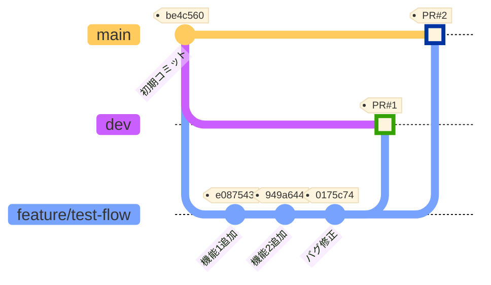
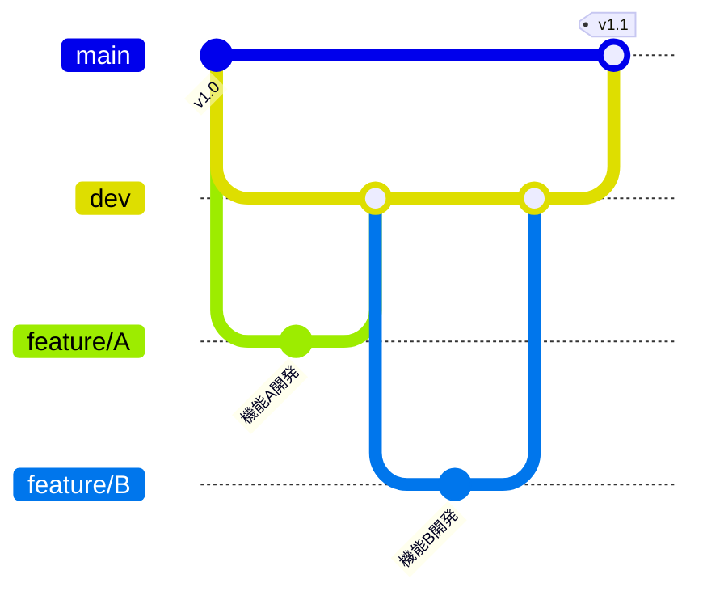
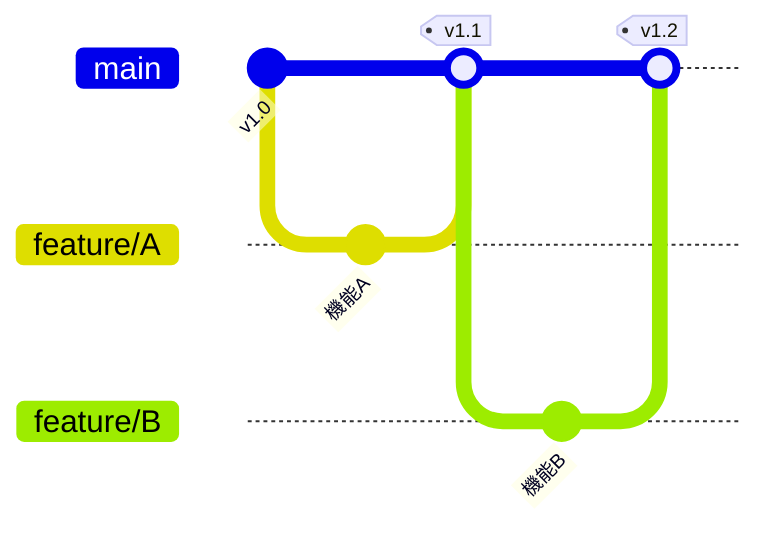

# Git Feature Flow 検証リポジトリ

このリポジトリは、Git feature flowの動作を検証するために作成されました。

## 検証内容

- featureブランチからdevブランチへのSquash merge
- featureブランチからmainブランチへのSquash merge
- マージ後の履歴の見え方の確認

## ブランチ構成

- `main`: 本番環境用のメインブランチ
- `dev`: 開発環境用のブランチ
- `feature/*`: 機能開発用のブランチ

## Git Feature Flow 図

このリポジトリで検証したGit feature flowを図示します。



### フローの説明

1. **初期状態**: `main`ブランチに初期コミット (be4c560)
2. **dev ブランチ作成**: mainから開発用のdevブランチを分岐
3. **feature ブランチ作成**: devからfeature/test-flowブランチを分岐
4. **機能開発**: featureブランチで3つのコミットを作成
   - 機能1追加 (e087543): `feat: 機能1のファイルを追加`
   - 機能2追加 (949a644): `feat: 機能2のファイルを追加`
   - バグ修正 (0175c74): `fix: 機能3のバグ修正とパフォーマンス改善`
5. **devへマージ**: PR #1でSquash mergeし、3つのコミットを1つにまとめる (97cae5b)
6. **mainへマージ**: PR #2でSquash mergeし、3つのコミットを1つにまとめる (a7e1e87)

### Squash Merge の効果

- ✅ **履歴が整理される**: 3つのコミット → 1つのコミット
- ✅ **PR番号が自動付与**: `(#1)`, `(#2)` が追加される
- ✅ **トレーサビリティ**: GitHubでPRから元のコミット履歴を確認可能
- ⚠️ **異なるコミットハッシュ**: dev (97cae5b) と main (a7e1e87) で別のコミットが生成される

## featureブランチの分岐戦略

このリポジトリでは **devから分岐** する方法で検証していますが、**必須ではありません**。
プロジェクトの性質や開発フローに応じて選択できます。

### devから分岐 vs mainから分岐

| 観点 | devから分岐 | mainから分岐 |
|------|------------|-------------|
| **基準コード** | 開発中の最新コード | 本番環境の安定コード |
| **安定性** | ⚠️ 他の開発の影響を受ける | ✅ 安定したベース |
| **最新機能** | ✅ 他の開発成果を利用可能 | ❌ 最新機能は含まれない |
| **統合** | ✅ 早期統合テスト | ⚠️ 統合が遅れる可能性 |
| **コンフリクト** | ⚠️ devマージ時に発生 | ✅ mainとの差分が明確 |
| **独立性** | ❌ 他のfeatureに依存しやすい | ✅ 完全に独立 |

### 推奨される使い分け

#### devから分岐を推奨

```bash
git checkout dev
git checkout -b feature/new-feature
```

**適しているケース:**
- 📱 **通常の機能開発**: 新機能の追加
- 🔄 **継続的な開発**: アジャイル/スプリント開発
- 👥 **チーム開発**: 複数人が並行して開発
- 🧪 **統合重視**: 早期に統合テストしたい
- 🔗 **機能連携**: 他の開発成果を活用したい

**メリット:**
- 他のfeatureブランチの成果を利用できる
- 頻繁にdevにマージして早期に問題発見
- 開発の連続性が保たれる

**デメリット:**
- dev上の未完成機能に影響される可能性
- 依存関係が複雑化しやすい

#### mainから分岐を推奨

```bash
git checkout main
git checkout -b hotfix/critical-bug
```

**適しているケース:**
- 🚨 **Hotfix**: 本番バグの緊急修正
- 🏷️ **リリース作業**: 特定バージョンのリリース準備
- 🔧 **独立した修正**: 他の開発と無関係
- 📝 **ドキュメント更新**: README等の更新
- 🎯 **単独リリース**: 単独でリリースしたい機能

**メリット:**
- 本番環境と同じ安定したコードベース
- 他の開発の影響を受けない
- 単独でテスト・リリース可能

**デメリット:**
- 最新の開発成果を利用できない
- 同じ箇所の変更でコンフリクトしやすい
- devとの統合が後回しになりがち

### 実際の開発フロー例

#### パターン1: Git Flow型（devから分岐）



- **特徴**: 開発はdevで統合、mainは安定版
- **向いている**: 計画的なリリースサイクル

#### パターン2: GitHub Flow型（mainから分岐）



- **特徴**: mainに直接マージ、常にデプロイ可能
- **向いている**: 継続的デリバリー

### このリポジトリの検証内容

このリポジトリでは **パターン1（Git Flow型）** を採用し、以下を検証しています：

1. featureブランチを **devから分岐**
2. devとmain **両方にSquash merge**
3. 各ブランチでの **履歴の見え方を確認**

この方法により、開発ブランチ（dev）での統合と、本番ブランチ（main）への安定したリリースを両立できます。

### 重要な注意点

⚠️ **どちらから分岐するかは、チーム内で統一することが重要です**

- 混在すると履歴が複雑になり、マージ戦略が不明瞭になります
- プロジェクト開始時にルールを決めてドキュメント化しましょう
- ただし、Hotfixなど特殊なケースは例外として扱うことも検討してください
